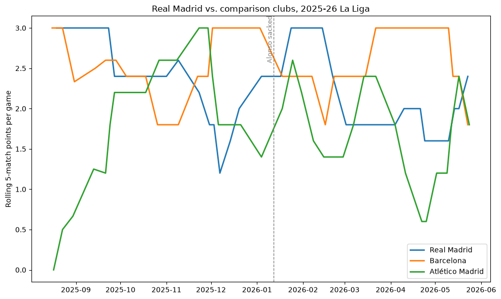

# ⚽ The Sacking Effect

**Does firing the manager actually change a football team's results — or would it have happened anyway?**

Real Madrid sacked Xabi Alonso on January 12, 2026, seven months into the job, after a Supercopa final loss to Barcelona. The headlines write themselves either way: *"new manager bounce"* if results improve, *"panic move"* if they don't. This project skips the headline and asks the harder question properly, using **synthetic control** — a causal inference method built for exactly this situation: one team, one event, no control group, no A/B test possible.

It's the same family of technique economists use to evaluate real policies (the California tobacco-tax study is the textbook example) and that marketing/growth teams use to measure whether a campaign actually caused a lift. Sport is just the sandbox — the method is the point.

---

## The idea, in 30 seconds

Instead of comparing Real Madrid's results before and after the sacking (unreliable — form changes for a hundred reasons that have nothing to do with the manager), build a **synthetic Real Madrid**: a weighted blend of other elite clubs that never fired their manager, chosen so it closely tracks the real team's form *before* the event. If that synthetic twin fits well pre-event, the gap between it and the real team *after* the event is a defensible estimate of the sacking's actual effect.

---

## Where this stands right now — Phase 1 complete

The first real output: rolling 5-match points-per-game for Real Madrid against two same-league benchmarks, Barcelona and Atlético Madrid, across the full 2025-26 season.



**What it already shows, and why it's not the answer yet:**

Real Madrid does jump to a sustained run of 3.0 points per game for about six weeks right after the sacking — the "bounce" story. But Real was *already* climbing beforehand (up from ~1.2 in early December to 2.4 right at the event), so some of that rise could just be a trend continuing on its own. Then in March–April, Real actually dips *below* both Barcelona and Atlético before recovering again at season's end. Eyeballing this chart alone, you genuinely can't tell whether the sacking helped, hurt, or did nothing — which is the entire justification for building this properly instead of trusting a before/after comparison.

Atlético's own swing across the season (0 → 3.0 → 0.6, with no managerial change at all) is a reminder of how noisy a single team's single season is, which is exactly why the real analysis blends *several* donor clubs rather than eyeballing one comparison.

---

## Roadmap

- [x] **Phase 1 — Scope & data audit.** Case list locked, real `soccerdata` schema confirmed, sanity-check chart built (above).
- [ ] **Phase 2 — Unified panel.** Pull the full donor pool (Bayern, Man City, Liverpool, Arsenal, PSG, Inter) and align every team on *matchweeks relative to treatment*, not calendar dates.
- [ ] **Phase 3 — First synthetic control fit.** Fit the Alonso → Arbeloa case with `pysyncon`, check pre-treatment fit quality before trusting anything.
- [ ] **Phase 4 — Placebo tests.** In-space and in-time placebo tests — how you argue significance without a traditional p-value.
- [ ] **Phase 5 — Full case bank.** Repeat across all six historical Real Madrid managerial changes; look for heterogeneity.
- [ ] **Phase 6 — Write-up + dashboard.** Portfolio-ready report, optionally a clickable Streamlit app.

## The six cases

| Date | Change |
|---|---|
| Dec 2005 | Luxemburgo → López Caro |
| Dec 2008 | Schuster → Ramos |
| Jan 2016 | Benítez → Zidane |
| Oct 2018 | Lopetegui → Solari |
| Mar 2019 | Solari → Zidane |
| **Jan 2026** | **Alonso → Arbeloa** *(flagship case, in progress)* |

## Donor pool

Real Madrid's talent level rules out ordinary mid-table comparisons, so the donor pool is deliberately elite: **Barcelona, Atlético Madrid** (same league), plus **Bayern Munich, Manchester City, Liverpool, Arsenal, PSG, Inter Milan** — clubs the synthetic-control algorithm can plausibly blend into a believable counterfactual Real Madrid.

## Method notes for the curious

Validity here isn't "does the chart look convincing" — it's two checks that come later in the roadmap:
- **Pre-treatment fit quality (MSPE):** if the synthetic team doesn't track the real one closely *before* the event, nothing after the event can be trusted.
- **Placebo tests:** re-running the exact same procedure on every donor team, pretending each was "treated," to see how often a gap this size shows up by chance alone. This stands in for a p-value.

## Stack

- [`soccerdata`](https://soccerdata.readthedocs.io/) — FBref access with proper rate-limiting/caching (FBref blocks naive scrapers outright)
- [`pysyncon`](https://github.com/sdfordham/pysyncon) — synthetic control + placebo testing
- `pandas`, `numpy`, `matplotlib`
- Background reading: [*Causal Inference: The Mixtape*](https://mixtape.scunning.com) by Scott Cunningham (free online)

## Running it

```bash
python -m venv venv && source venv/bin/activate   # Windows: venv\Scripts\activate
pip install -r requirements.txt
python src/data_pull.py        # Phase 1
```

Before trusting any pull, confirm the current `soccerdata` schema — it has shifted across versions:

```python
import soccerdata as sd
schedule = sd.FBref(leagues="ESP-La Liga", seasons=["2025-2026"]).read_schedule().reset_index()
print(schedule.columns.tolist())
```

## Repo structure

```
the-sacking-effect/
  data/
    raw/          # cached pulls, gitignored
    processed/    # cleaned panel.csv, tracked
  src/
    data_pull.py
    panel_builder.py
    synthetic_control.py
    placebo_tests.py
  notebooks/
  output/          # charts + results tables (this README's chart lives here)
  README.md
  requirements.txt
  .gitignore
  LICENSE
```

## Why this exists

Synthetic control and its close cousin, difference-in-differences, are what marketing and growth teams reach for when they can't run a clean experiment — did the campaign cause the lift, or was it the season? What policy teams use for program evaluation. Building this end-to-end — real messy data, a genuine counterfactual, and validity checks instead of a nice-looking chart — is the point, whether or not Real Madrid ever wins another trophy.

## License

MIT — see `LICENSE`.
